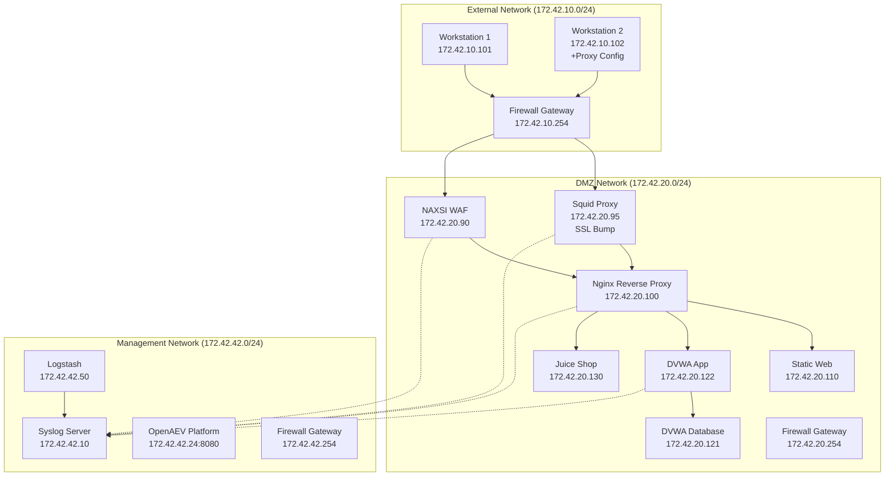
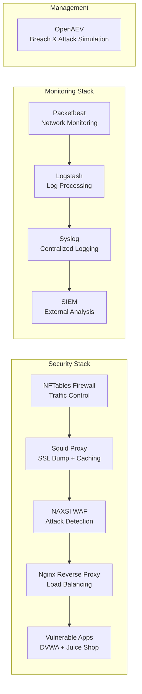

# BlackIce-lab

## Overview

BlackIce-lab is a comprehensive cybersecurity training environment designed to simulate a production-like network infrastructure with intentional security vulnerabilities. This containerized lab provides security professionals with a realistic testing ground for threat detection, vulnerability assessment, and SIEM configuration.

## Purpose

The primary goal of BlackIce-lab is to create a **prod-like environment** with:
- **Intentional security flaws** for vulnerability testing
- **Comprehensive logging** for SIEM integration and analysis
- **Realistic network topology** mimicking enterprise environments
- **Traffic generation capabilities** for threat simulation

Perfect for testing and training with:
- Vulnerability scanners
- SIEM solutions
- Security tools and techniques
- Penetration testing methodologies

## Directory Structure

```
BlackIce-lab/
├── dvwa/              # Vulnerable web application
├── juice/             # OWASP Juice Shop
├── nginx/             # Reverse proxy configuration
├── naxsi/             # Web Application Firewall
├── nftables/          # Firewall rules and routing
├── squid/             # SSL-bumping proxy
├── staticweb/         # Simple web application
├── syslog/            # Centralized logging
├── packetbeat/        # Network monitoring
├── openaev/           # Attack simulation platform
├── ws/                # Client workstations
└── makefile           # Orchestration commands
```

## Architecture

### Network Topology



### Security Components



## Quick Start

### Prerequisites

- Docker Engine
- Docker Compose

### 1. Clone and Initialize

```bash
git clone <repository-url>
cd BlackIce-lab
```

### 2. Start the Lab

```bash
# Create networks and start all services
make lab-start
```

This command will:
1. Create three Docker networks (EXT, DMZ, MGMT)
2. Start all services in correct dependency order
3. Initialize logging and monitoring

### 3. Verify Deployment

Check that all services are running:

```bash
docker ps --format "table {{.Names}}\t{{.Status}}\t{{.Ports}}"
```

### 4. Access Services

| Service | URL | Credentials |
|---------|-----|-------------|
| **Static Web** | http://172.42.20.90/ | - |
| **DVWA** | http://172.42.20.90/dvwa/ | admin/password |
| **Juice Shop** | http://172.42.20.90/juice/ | - |
| **OpenAEV** | http://127.0.0.1:8080 | contact@kakudou.org/kakudou |

## Service Details

### Vulnerable Applications

#### DVWA (Damn Vulnerable Web Application)
- **Purpose**: Web application security testing
- **Location**: `/dvwa/` path
- **Database**: MariaDB with weak credentials
- **Vulnerabilities**: SQL injection, XSS, File upload, etc.

#### OWASP Juice Shop
- **Purpose**: Modern web application vulnerabilities
- **Location**: `/juice/` path
- **Features**: 100+ challenges, OWASP Top 10 coverage

### Security Infrastructure

#### NFTables Firewall
- **Function**: Network segmentation and traffic control
- **Rules**:
  - EXT → DMZ web traffic through WAF only
  - Direct access blocked to web ports (80/443)
  - Management network unrestricted
- **Logging**: All dropped packets logged

#### Squid Proxy (SSL Bump)
- **Function**: Transparent HTTPS interception
- **Features**: SSL certificate generation, traffic logging
- **Configuration**: Intercepts all HTTPS traffic from EXT network

#### NAXSI WAF
- **Function**: Web Application Firewall
- **Rules**: SQL injection, XSS, RFI detection
- **Mode**: Currently in detection mode (logs but allows)

### Monitoring & Logging

#### Centralized Syslog
- **Collector**: All services send logs to 172.42.42.10:514
- **Storage**: `/syslog/logs/all.log`
- **Forwarding**: Configured to forward to external SIEM

#### Packetbeat Monitoring
- **Coverage**: Network traffic analysis on all containers
- **Processing**: Logstash → Syslog pipeline
- **Protocols**: HTTP, DNS, TLS, TCP flows

#### OpenAEV (Breach & Attack Simulation)
- **Purpose**: Automated attack scenario generation
- **Features**: MITRE ATT&CK framework integration
- **Access**: Web UI for scenario management

## Laboratory Scenarios

### 1. Basic Vulnerability Scanning

```bash
# From external workstation
docker exec -it ws1 bash
nmap -sS -O 172.42.20.0/24
```

### 2. Web Application Testing

```bash
# Test SQL injection on DVWA
curl -X POST "http://172.42.20.90/dvwa/vulnerabilities/sqli/" \
  -d "id=1' OR 1=1-- -&Submit=Submit"
```

### 3. SSL Interception Analysis

```bash
# Check certificate chain through proxy
openssl s_client -connect 172.42.20.95:3128 -proxy 172.42.20.95:3128
```

### 4. WAF Bypass Techniques

```bash
# Test WAF evasion
curl "http://172.42.20.90/?test=<script>alert('xss')</script>"
```

### 5. Traffic Analysis

```bash
# Monitor logs in real-time
tail -f ./syslog/logs/all.log | grep -E "(BLOCK|ALERT|ERROR)"
```

## SIEM Integration

### Splunk Configuration

1. **Add Data Input**: UDP 514 for syslog
2. **Configure Parsing**: Custom sourcetypes for each service
3. **Create Dashboards**: Network traffic, security events

### ELK Stack Integration

```yaml
# Logstash input configuration
input {
  udp {
    port => 514
    type => "syslog"
  }
}

filter {
  if [type] == "syslog" {
    grok {
      match => { "message" => "%{SYSLOGTIMESTAMP:timestamp} %{IPORHOST:host} %{DATA:program}: %{GREEDYDATA:message}" }
    }
  }
}
```

## Security Features & Flaws

### Intentional Vulnerabilities

| Component | Vulnerability | Purpose |
|-----------|---------------|---------|
| **DVWA** | Multiple OWASP Top 10 | Web app security training |
| **Juice Shop** | Modern web vulns | Advanced testing scenarios |
| **Squid SSL** | Certificate trust issues | PKI/TLS testing |
| **Database** | Weak credentials | Access control testing |
| **Firewall** | Permissive rules | Network security analysis |

### Monitoring Capabilities

- **Network Traffic**: Full packet capture and analysis
- **Application Logs**: HTTP requests, responses, errors
- **Security Events**: WAF triggers, failed authentications
- **System Events**: Process execution, file access


## Management Commands

```bash
# Start entire lab
make lab-start

# Stop entire lab
make lab-stop

# Individual service management
make dvwa-start
make dvwa-stop
make nginx-start
make squid-start

# Network management
make create-net
make network-stop

# Monitoring
make packetbeat-start
make packetbeat-stop
```

## Troubleshooting

### Common Issues

**Services not starting:**
```bash
docker-compose logs <service-name>
make network-stop && make lab-start
```

**Network connectivity issues:**
```bash
docker network ls
docker network inspect blackice_lab_dmz
```

**Log forwarding problems:**
```bash
docker exec syslog netstat -ulnp
telnet 172.42.42.10 514
```

### Debug Commands

```bash
# Check firewall rules
docker exec nftables nft list ruleset

# Test proxy functionality
docker exec ws2 curl -v --proxy http://172.42.20.95:3128 https://www.google.com

# Verify WAF detection
curl "http://172.42.20.90/?test=<script>" -v
```

## Learning Objectives

After using BlackIce-lab, you should understand:

1. **Network Security Architecture**: Multi-tier network design, DMZ concepts
2. **Proxy Technologies**: SSL interception, transparent proxying
3. **Web Application Firewalls**: Rule configuration, bypass techniques
4. **Vulnerability Assessment**: Scanner configuration, result analysis
5. **SIEM Implementation**: Log collection, parsing, alerting
6. **Attack Simulation**: Automated testing, threat modeling

## Contributing

Feel free to:
- Add new vulnerable applications
- Enhance monitoring capabilities
- Improve documentation
- Share interesting attack scenarios

## Legal Disclaimer

This lab is designed for **educational purposes only**. The included vulnerabilities are intentional and should never be deployed in production environments. Users are responsible for ensuring proper isolation and security of the lab environment.

---

**Happy Hacking!**

*For questions or support, contact: contact@kakudou.org*
